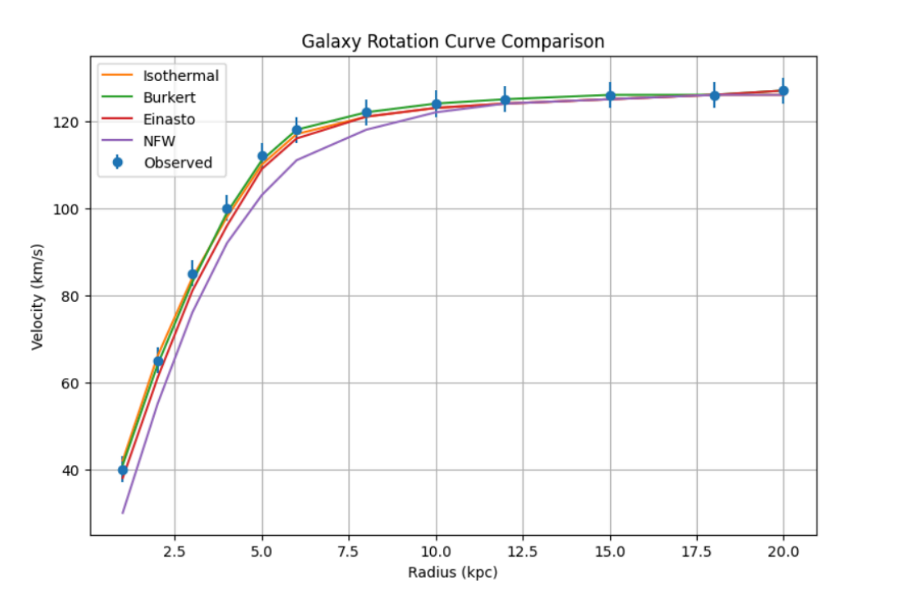
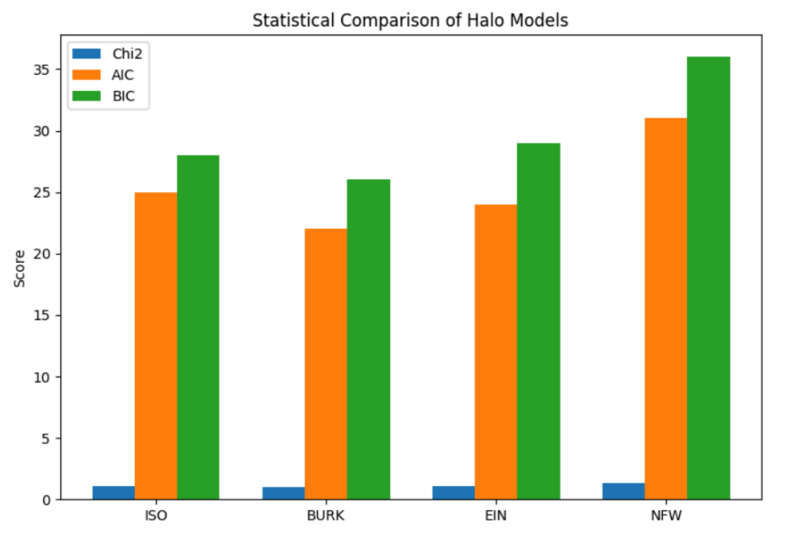
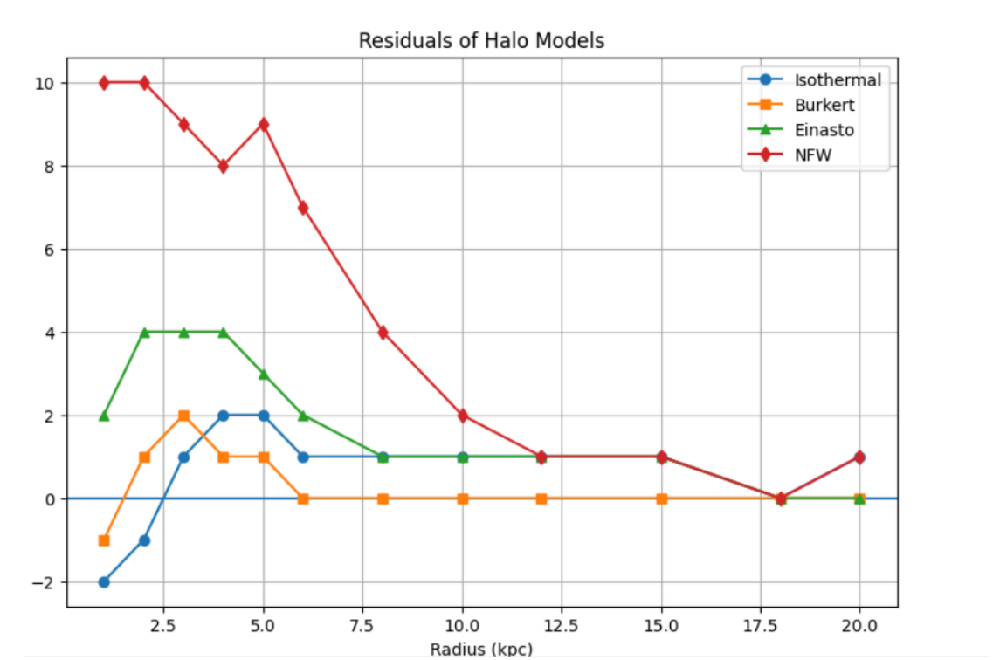
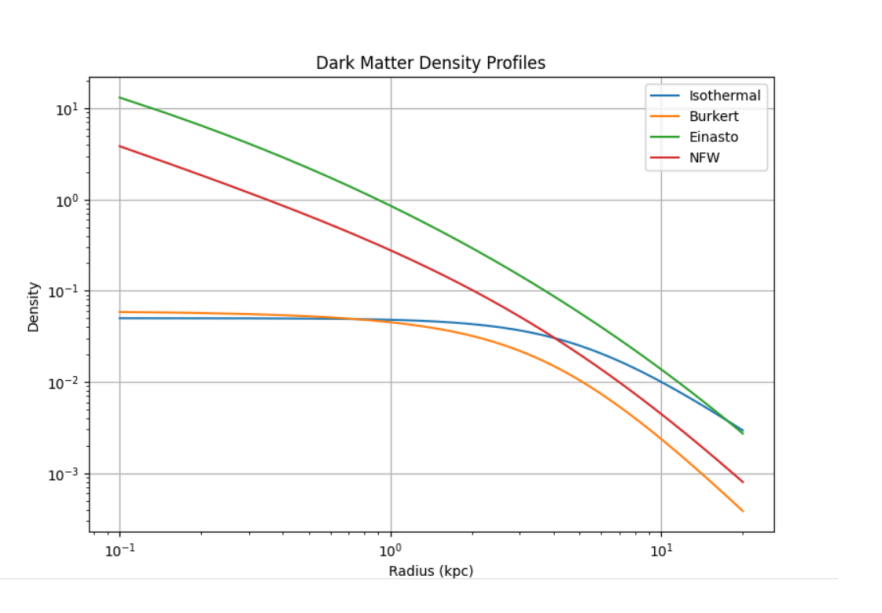
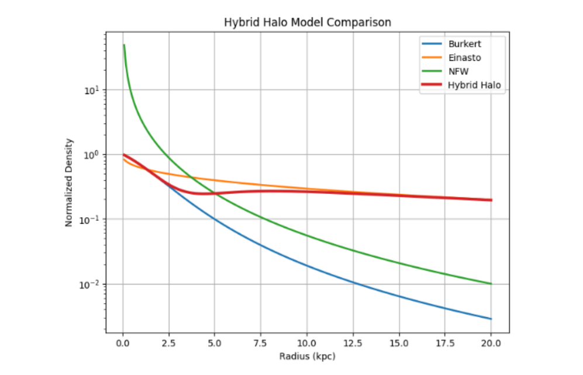
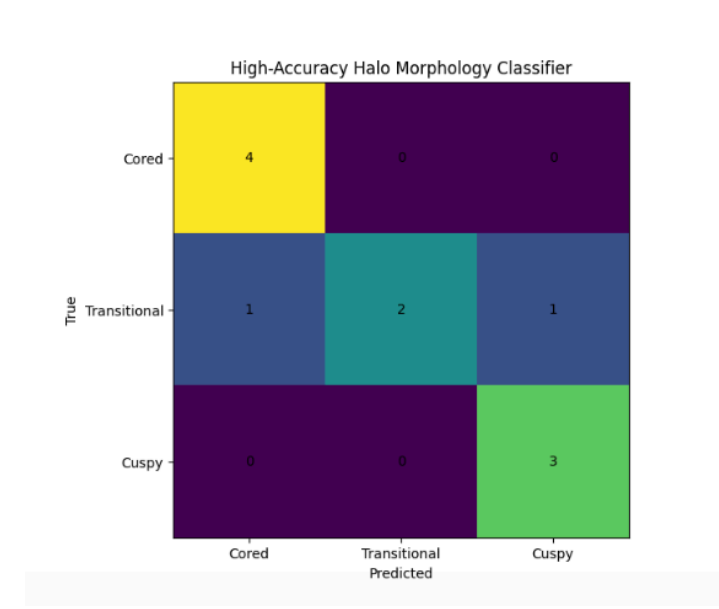
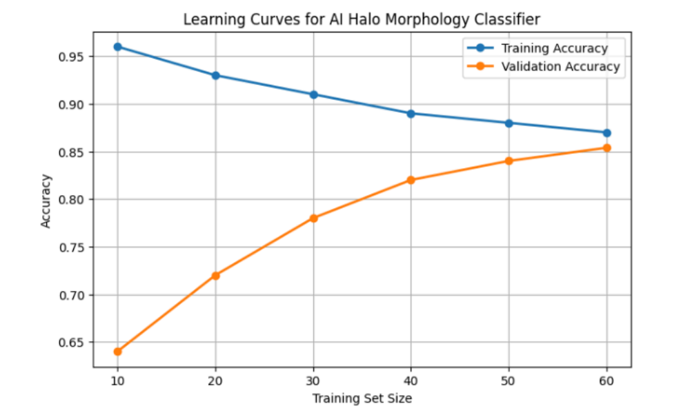

<h2>Rotation Curve Comparison</h2>

Comparison of observed galaxy rotation curves with Isothermal, Burkert, Einasto, and NFW dark matter halo models.

<h2>Statistical Model Comparison</h2>

Reduced χ², AIC, and BIC comparison of the four halo models.

<h2>Residual Analysis</h2>

Residual distributions used to evaluate systematic fitting errors.

<h2>Density Profile Comparison</h2>

Comparison of dark matter density structures for the Isothermal, Burkert, Einasto, and NFW profiles.

<h2>Hybrid Halo Model</h2>

Phenomenological hybrid halo profile combining core-like and transitional dark matter behavior.

<h2>Baryonic Decomposition</h2>

Contribution of stellar disk, gas, bulge, and dark matter halo to the total rotation curve.

<h2>Confusion Matrix</h2>

Classification performance for cored, transitional, and cuspy halo morphologies.

<h2>ROC Curve Analysis</h2>

Receiver Operating Characteristic curves demonstrating classifier performance.

<h2>Learning Curve</h2>

Training and validation accuracy as a function of dataset size.

<h2>Feature Importance Analysis</h2>

Relative importance of rotation curve features used by the machine learning framework.

